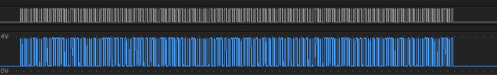
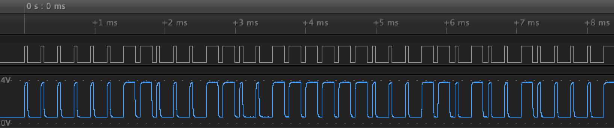
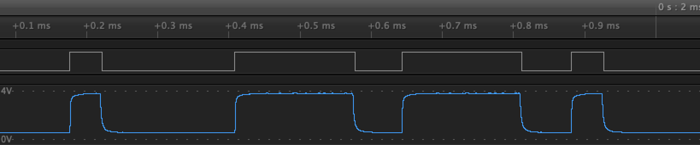

# Cardax IV

## About

The Cardax IV protocol is used between older, Cardax-era readers, and Cardax/Gallagher-era controllers (and break-out devices).

## Electrical specification

The protocol uses two unidirectional serial connections, with a connection from the reader to the controller (usually coloured white), and one from the controller to the reader (usually coloured blue). The reader and controller should have a shared reference ground.

On these connections, pulse-width modulation (PWM) is used, with voltages of 0V (defined as logic low) and 5V (defined as logic high). The lengths of the pulses appear to depend on the direction of data transfer, but this may be an artifact of not knowing the exact specification and only being able to observe a few implementations.

The connections are not daisy-chainable; there are no device addresses.

## Protocol specification

Across these connections, a simple message-based protocol is defined.

### Reader to controller

The reader to controller connection has the following timings:

* 0 bit = short pulse of logic high: ~0.04276ms
* 1 bit = long pulse of logic high: ~0.1628ms
* Time between bits = ~0.22996ms

The connection idles logic low.

The following messages are defined:

#### Card data messages

These messages use the [reader type](../reader-types.md) enumeration to specify the type of card data held in the message.

The checksums used in each is simply an XORing of all the message data (after the opcode, before the checksum itself).

The messages are re-sent by a reader every 400ms until some kind of acknowledgement is received.

* `0x00`: Card data, reader type `0xF9`
* `0x01`: Card data, reader type `0xFF`
* `0x02`: Card data, reader type `0xFE`

  These opcodes are followed by the card data and a checksum.

* `0x03`: Card data, arbitrary reader type

  This opcode is followed by a 1 byte length, a 1 byte reader type, the card data, and a checksum.

#### Keypad messages

* `0xC{0,3,5,6,9}`: Keypad number button press
* `0xD{1,2,4,7,8}`: Keypad number button press
* `0xCA`: Keypad CE button press
* `0xCC`: Keypad IN button press
* `0xDB`: Keypad F1 button press
* `0xDD`: Keypad F3 button press
* `0xDE`: Keypad F2 button press

#### Heartbeat message

* `0xFF`: Heartbeat

  This message is sent after 7 seconds of inactivity. Some readers (e.g. the T11) send an extra `0x00` byte after the opcode.

### Controller to reader

The controller to reader connection has the following timings:

* 0 bit = short pulse of logic low: ~0.044ms
* 1 bit = long pulse of logic low: ~0.845ms
* Time between bits = ~2.5ms

The connection idles logic high.

The following messages are defined. Note that each message is simply the opcode followed by its bitwise inverse.

#### Configuration

These messages are sent by the controller to set reader configuration.

* `0x07`: Deny Mifare (T-series readers only)
* `0x08`: Deny 125 (T-series readers only)
* `0x09`: ? (seen in Bert s/w)
* `0x0A`: Enable admin card
* `0x0B`: Use Mifare extended data format (i.e. reader type `0xF7`)
* `0x0C`: Use high security
* `0x0D`: Don't use high security
* `0x0E`: Use CSN
* `0x0F`: Don't use CSN

#### Buzzer

* `0x10`: Stop buzzer
* `0x11`: Start buzzer
* `0x18`: Granted
* `0x19`: Denied

#### LEDs

* `0x21`: Red LED on
* `0x22`: Green LED off
* `0x23`: Red LED off
* `0x24`: Green LED on

#### Status / display

* `0x40`: ? (seen in Bert s/w)
* `0x49`: Not secure
* `0x4A`: Hide over bell
* `0x4B`: Hide under bell
* `0x58`: Fail
* `0x59`: Secure
* `0x5A`: Show over bell
* `0x5B`: Show under bell
* `0x81`: Set secure access
* `0x82`: PIN only
* `0x83`: Free access
* `0x8A`: Show wait & failure
* `0x8F`: Flash all
* `0x90`: Show default
* `0x91`: Ask for PIN
* `0x92`: Display wrong PIN
* `0x93`: Request second card
* `0x95`: Flash over bell & under bell & card, show bell
* `0x96`: Flash over bell & under bell & keypad, show bell
* `0x97`: Flash bell, start alarm
* `0x98`: Display set failed (T12: long beep)
* `0x9F`: Display standby

#### Keypad button acknowledge

These are sent after a reader sends a keypad button press message.

* `0xA3`: Keystroke ACK
* `0xA5`: Beep

#### MIFARE key loading

The MIFARE key loader tool for Cardax IV readers sends `0xB1 0xC0 0xD5` followed by `0xE[n]` for each of 12 MF key nibbles.

* `0xB1`: Config MF key? 1
* `0xC0`: Config MF key? 2
* `0xD5`: Config MF key? 3
* `0xE[0-F]`: Config MF key? 0-F nibble

#### Heartbeat

* `0xFF`: Heartbeat (sent by GBUS Universal Reader Interface (URI))


## Example

Here's a sample waveform (at increasing zoom levels) from a reader sending a card read:





We can decode this to the message bytes:

```
03 19 F8 D2 11 F6 A3 EB 1D D4 30 13 A7 9E 4D 4C
C9 46 3E 3C 54 51 E3 28 34 39
```

This is a "Card data, arbitrary reader type" message, with card data
`D2 11 F6 A3 EB 1D D4 30 13 A7 9E 4D 4C C9 46 3E 3C 54 51 E3 28 34`
of type `0xF8`.
